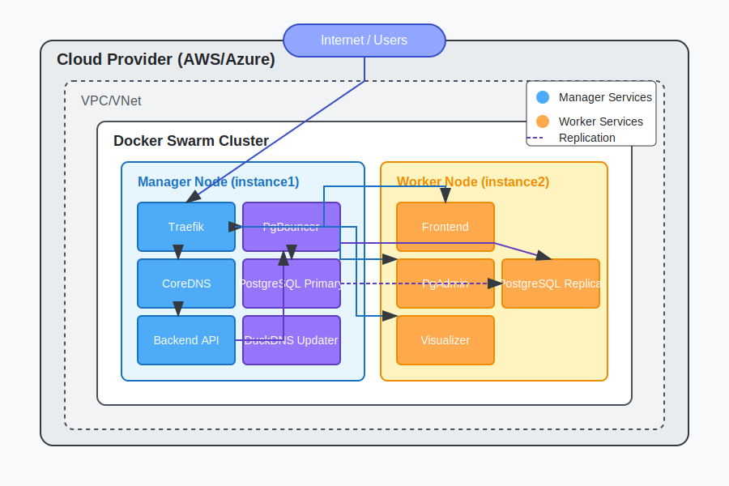
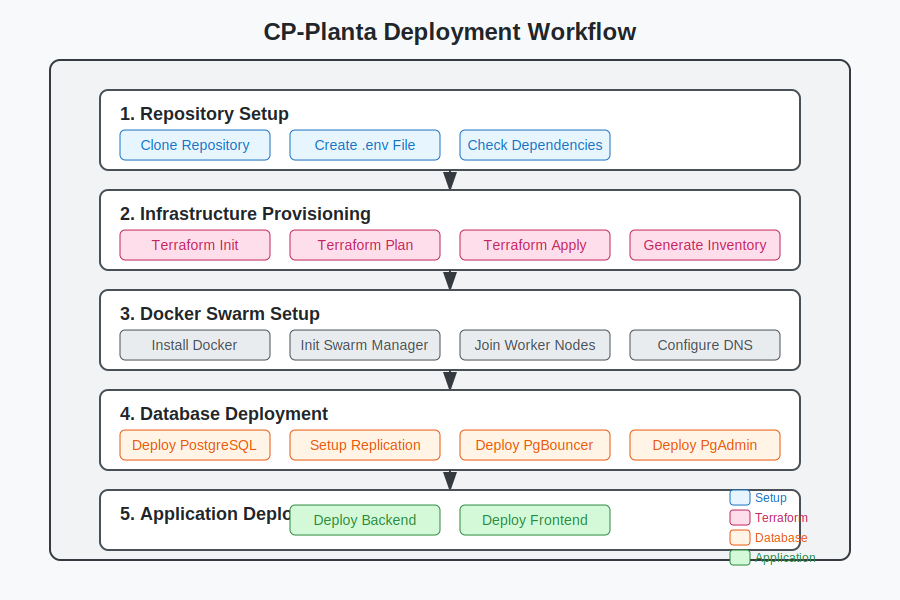
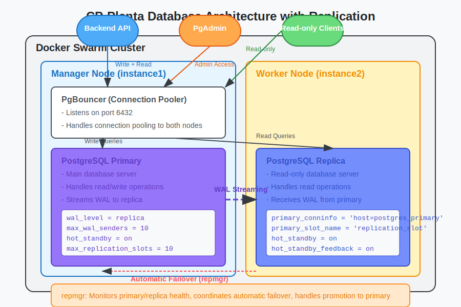
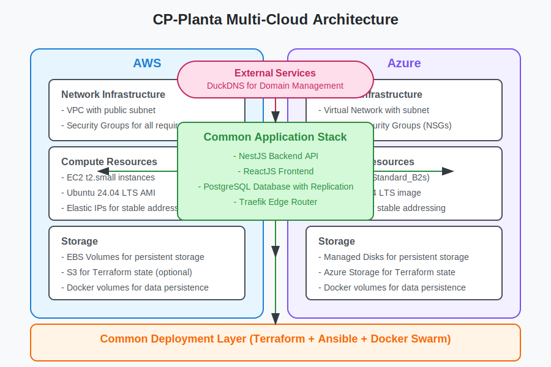

# 🌱 CP-Planta Project

## Cloud-native application for managing production processes in a hygienized food plant


## 📋 Overview

CP-Planta is a comprehensive web application for optimizing and managing production processes in a hygienized food plant. The system enables efficient tracking of raw materials, production stages, and quality control in compliance with industry standards.

This project is developed by the AGES (Agência Experimental de Engenharia de Software) team for Hortti Tech as part of the AGES III course at PUCRS.

## 🏗️ Project Architecture

The CP-Planta application follows a modern microservices architecture, deployed using infrastructure as code principles on multiple cloud platforms.



### Key Components

- **Frontend**: React.js application with Tailwind CSS
- **Backend**: NestJS API with Prisma ORM
- **Database**: PostgreSQL with primary-replica replication
- **Infrastructure**: Multi-cloud deployment supporting AWS and Azure
- **Orchestration**: Docker Swarm for container management

### Deployment Workflow

Our deployment process is fully automated, allowing for consistent, repeatable deployments across cloud providers:



### Database Architecture

The database layer implements high availability through PostgreSQL replication:



### Multi-Cloud Support

The infrastructure supports deployment to multiple cloud providers with the same codebase:



## 🛠️ Repository Structure

This repository serves as the root project, containing all CP-Planta components as submodules:

- [**AGES-III-CP-Planta-Frontend**](https://github.com/Saccilotto-AGES-Projects/AGES-III-CP-Planta-Frontend): React.js frontend application
- [**AGES-III-CP-Planta-Backend**](https://github.com/Saccilotto-AGES-Projects/AGES-III-CP-Planta-Backend): NestJS backend API
- [**AGES-III-CP-Planta-Infra**](https://github.com/Saccilotto-AGES-Projects/AGES-III-CP-Planta-Infra): Infrastructure as Code and deployment scripts

## 🚀 Getting Started

### Prerequisites

- Git
- Docker and Docker Compose (for local development)
- Node.js 18+ and npm/yarn
- Terraform and Ansible (for production deployment)

### Clone with Submodules

```bash
# Clone the main repository with all submodules
git clone --recursive https://github.com/Saccilotto-AGES-Projects/AGES-III-CP-Planta.git

# Navigate to the project folder
cd AGES-III-CP-Planta
```

### Local Development

```bash
# Start all services locally with Docker Compose
docker-compose up -d

# Access the services
Frontend: http://localhost:3001
Backend API: http://localhost:3000
PgAdmin: http://localhost:5050
```

### Production Deployment

For complete deployment instructions, see the [Infrastructure Documentation](https://github.com/Saccilotto-AGES-Projects/AGES-III-CP-Planta-Infra/blob/main/README.md).

Quick deployment steps:

```bash
# Navigate to the infrastructure folder
cd AGES-III-CP-Planta-Infra

# Configure your environment variables
cp .env.example .env
# Edit .env with your cloud provider credentials

# Deploy to AWS (default)
./deploy.sh --provider aws

# Or deploy to Azure
./deploy.sh --provider azure
```

## 📊 Project Features

The CP-Planta system provides the following key capabilities:

- **Raw Material Management**: Track incoming materials and inventory
- **Production Planning**: Schedule and monitor production orders
- **Process Control**: Record and visualize production stages
- **Quality Assurance**: Document inspections and quality issues
- **Traceability**: Complete history for each batch from raw materials to final product
- **Inventory Control**: Manage stock levels of raw materials and finished products

## 👥 Contributors

- [André Sacilotto Santos](https://github.com/Saccilotto) - Infrastructure Architect
- Team members from AGES (Agência Experimental de Engenharia de Software)

## 📜 License

This project is licensed under the GNU Affero General Public License v3.0 - see the [LICENSE](LICENSE) file for details.

## 🙏 Acknowledgments

- **Hortti** - For the project requirements and industry expertise
- **AGES PUCRS** - For the project framework and academic guidance
